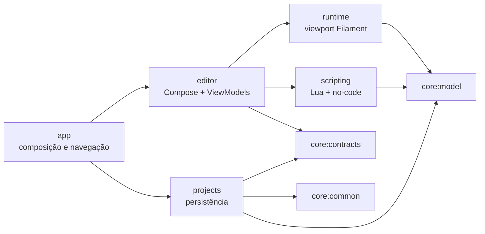

# Arquitetura

## Dependências



`SceneDocument` é a fonte comum entre editor, runtime e gameplay. A UI não
persiste nós gráficos nem conhece o formato GLB; o renderer não altera o
documento canônico; Lua e no-code operam por `LogicSceneHost`.

## Shell responsivo do editor

`EditorShell` mantém o viewport montado durante todo o fluxo. A política usa o
espaço útil em dp depois de `WindowInsets.safeDrawing`:

- compacto: viewport dominante e exatamente zero ou um painel inferior;
- expandido: hierarquia à esquerda, viewport ao centro, inspector à direita e
  assets/painel contextual abaixo.

Play remove ferramentas e docks, mantém Stop e bloqueia intents mutáveis no
ViewModel. O painel compacto recebe `imePadding` no contêiner externo para
permanecer acima do teclado sem consumir a própria altura.

## Cena e componentes

Uma cena JSON v1 contém `GameObject`s por ID, raízes, relação pai/filho,
configuração da câmera do editor e revisão. Cada objeto agrega componentes
serializáveis com ID e estado de ativação:

```text
GameObject
├── Transform
├── MeshRenderer
├── Camera
├── DirectionalLight
├── Collider
├── LuaScript
├── VisualGraph
└── TouchButton
```

O validador rejeita IDs duplicados, referências ausentes, ciclos, caminhos
inseguros, vetores não finitos, escalas inválidas e componentes duplicados. O
histórico é limitado a 50 comandos. Nesta vertical slice o ViewModel ainda usa
snapshots completos do documento para algumas edições; comandos granulares são
o próximo refinamento para cenas grandes.

## Runtime gráfico

O módulo `runtime` projeta apenas componentes visuais ativos em nós descartáveis
de SceneView/Filament. Cubos e planos usam materiais PBR; GLBs usam o loader
nativo do Filament. Transformações são atualizadas sem reabrir o modelo e
instâncias/materiais são destruídos quando a projeção muda. Cada geração de
carga possui um `ModelLoader` isolado; cancelar uma geração destrói a coleção
interna inteira, inclusive assets nativos ainda em carregamento.

O documento continua independente da biblioteca gráfica. `RuntimeEditorBridge`
mantém a fronteira para substituir ou complementar o runtime com Godot, Rust ou
C++ sem mover persistência e regras de cena para a UI.

## Gameplay

LuaJ recebe globals construídos explicitamente, sem `io`, `os`, `luajava`,
`require`, carregamento de arquivo ou debug público. Há limite de instruções,
tempo e callbacks. A API atual expõe busca de objeto, toque, rotação e log.

O grafo visual é um documento tipado e acíclico. O editor cria e conecta nós
reais, o repositório valida e salva o JSON e `VisualGraphExecutor` usa o mesmo
`LogicSceneHost` do Lua. O modo Visualizar clona a cena para que gameplay não
modifique a cena editável.

## Persistência

```text
files/projects/<uuid>/
├── project.json
├── scenes/main.scene.json
├── assets/models/
├── assets/assets.json
├── scripts/lua/
├── scripts/java/
├── visual-graphs/
├── prefabs/
├── ui/
├── plugins/
├── cache/
└── settings/
```

Arquivos internos são resolvidos contra a raiz confiável do projeto, com
prefixos permitidos, limites de tamanho e recusa de symlinks. Metadados e cena
são escritos por temporário no mesmo diretório, `fsync` e move atômico. Room é
somente um índice reconstruível; DataStore guarda preferências.

GLB importado é limitado a 16 MiB e validado como GLB 2.0 autocontido. O parser
prévio limita chunks, nós, meshes, materiais, buffer views, accessors,
primitivas e imagens. O parser nativo ainda precisa ser exercitado em
dispositivos e modelos hostis reais.

O runtime limita cada projeção a 256 objetos renderizáveis e 32 instâncias GLB.
Play aceita no máximo 8 scripts e 16 grafos ativos, com orçamento de 750 ms para
inicialização; eventos são serializados fora da thread principal em produção.

## Fronteiras não concluídas

- câmera/luz do documento ainda não dirigem a câmera/luz do modo Play;
- física, áudio, animação autoral e UI de jogo completa;
- editor de código Lua e diagnóstico visual por linha no celular;
- GLTF externo, OBJ e conversão FBX;
- pacote `.mobileproject`, exportação de jogo APK/AAB e assinatura;
- plugins Java, isolamento e permissões declarativas;
- matriz instrumentada completa e perfil em aparelho físico de 4 GB.
- execução de scripts/assets não confiáveis: falta quota rígida de heap Lua e
  orçamento de pixels decodificados para texturas GLB.
